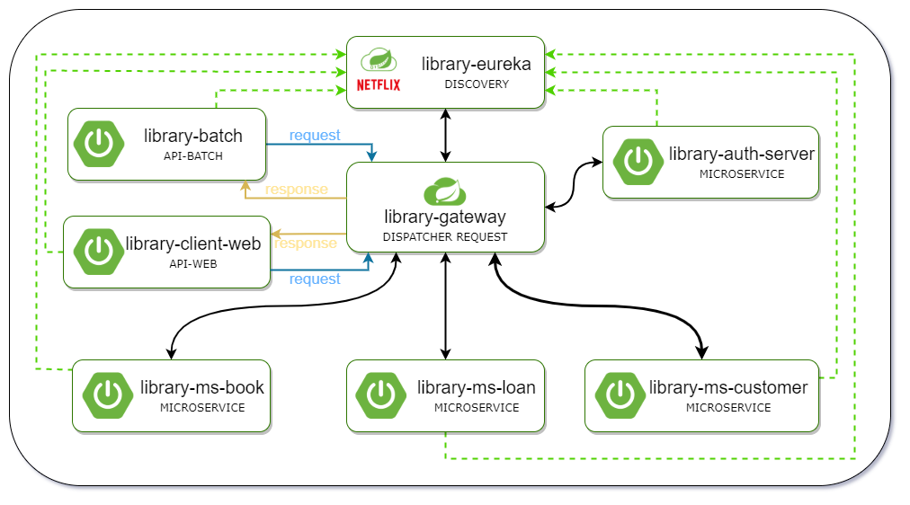
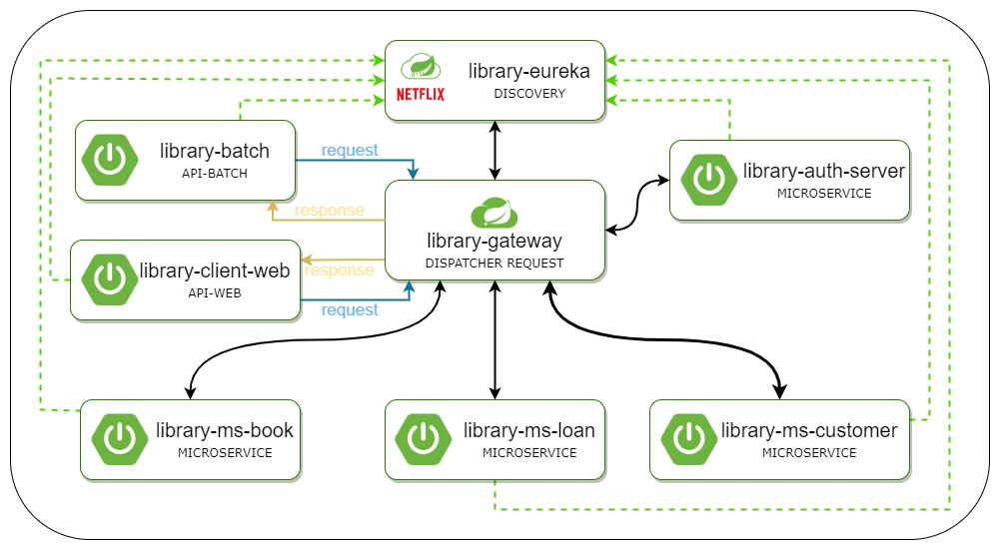

# LIBRARY-OC-P7

# Projet réalisé dans le cadre de la formation Développeur d'application JAVA OpenClassrooms.

	Création d'un site de gestion de bibliothèque de la ville.

# Contexte :

Vous travaillez au sein de la Direction du Système d’Information (DSI)  de la mairie d’une grande ville,
sous la direction de Patricia, la responsable du service. La DSI est en charge de tous les traitements numériques
pour la mairie et les structures qui lui sont rattachées, comme la gestion du site web de la ville par exemple.
À ce titre, Patricia est contactée par le service culturel de la ville qui souhaite moderniser la gestion de ses bibliothèques.
John, architecte logiciel, sera chargé de la validation technique du projet.

## Le projet :

**Le site web** 
Le but est de permettre aux usagers de suivre les prêts de leur ouvrages à travers une 
interface web:
 * Rechercher des ouvrages et voir le nombre d'exemplaire disponible.
 * Consulter leurs prêts en cours. 
 * Le prêt d'un ouvrage est prolongeable une seule fois.
 La prolongation ajoute une nouvelle période de prêt(4 semaines) à la période initiale.

 
**Un batch** 
Ce logiciel pour le traitement automatisé permettra d'envoyer des mails de relance
aux usagers n'ayant pas rendu les livres en fin de période de prêt. L'envoi sera automatique
à la fréquence d'un par jour.

**L'API web** 
Le site web ainsi que le batch communiqueront avec ce logiciel en REST afin de connaitre
les informations liées à la Base de donnée.

	
## Les contraintes fonctionnelles

	- Application web avec un framework MVC.
	- API web en microservices REST (Les clients (site web, batch) communiqueront avec cette API web) 
		-> factorisation de la logique métier.
	- Packaging avec Maven.
	
## Développement

	Cette application a été développé avec :
	- Intellij IDEA
	- Java 8 (version 1.8u241)
	- Tomcat 9
	- PostgreSQL 11 (version 11.5.2)
	- le framework Spring (version 5.2.1)
	- Spring boot
	- LOMBOK
	- Spring DATA JPA
	
L'application a été développée suivant une architecture microservice

## Déploiement

1- Importez tous les microservices du repository.

2- Créé une base de données pour chaque microservice. Les scripts sont dans le dossier "livrables/script".
Vous devez modifier les propriétés de la datasource dans chaque fichier "application.properties" de chaque
microservice (dans src/main/resources/).

3- Lancer l'application : démarrez "library-eureka" en premier.

Dans votre navigateur, vous pourrez accéder au site à l'addresse localhost:8080, si vous n'avez pas modifié
les propriétés "server.port".

## Auteur

M.COZ
